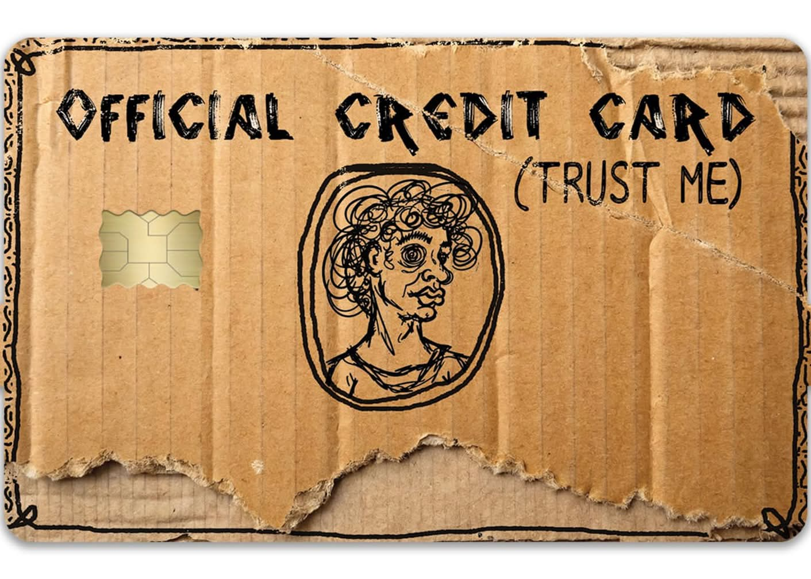
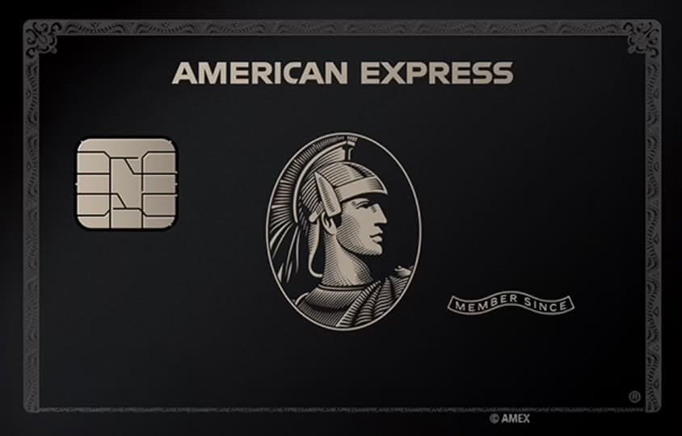

# AirCard-Guide 🎴

**Give your Apple Wallet cards a look you like.**

[中文](README.md) · English · [Download AirCard](https://github.com/Mak5er/AirCard/releases/latest) · [Card artwork](#card-artwork)

A **Chinese and English guide with sample artwork and an offline card editor**, put together by [BryceYuuu](https://github.com/BryceYuuu) for readers of the social post. This repository is a fork of [Mak5er/AirCard](https://github.com/Mak5er/AirCard). It adds practical guides, sample images, and an offline cropping tool while retaining the upstream application source. Credit for AirCard and its development belongs to the original author and contributors.

## What does AirCard do?

AirCard is a macOS tool that connects to an iPhone over USB to customize Apple Wallet / Apple Pay card artwork. It also supports lock screen passcode themes (`.passthm`) and theme creation. This guide focuses on **changing Wallet card artwork**.

Artwork changes are visual: an image does not create a bank card or change its payment permissions.

## Card artwork

Original card artwork for this guide. Use the links below to download them. If GitHub opens an image preview, choose **Download raw file**, or open **Raw** and save the image.

| Cardboard credit card | Minimal Apple artwork |
| :---: | :---: |
|  |  |
| [Download original PNG](https://raw.githubusercontent.com/BryceYuuu/AirCard-Guide/main/assets/skins/cardboard-credit-card.png) · 1411 × 1008 | [Download original PNG](https://raw.githubusercontent.com/BryceYuuu/AirCard-Guide/main/assets/skins/apple-minimal.png) · 1080 × 1080 |

| Amex black artwork | Trump Gold Card artwork |
| :---: | :---: |
|  |  |
| [Download original PNG](https://raw.githubusercontent.com/BryceYuuu/AirCard-Guide/main/assets/skins/amex-black.png) · 844 × 540 | [Download original PNG](https://raw.githubusercontent.com/BryceYuuu/AirCard-Guide/main/assets/skins/trump-gold-card.png) · 1536 × 969 |

**Cropping:** the current app scales images to fill and center-crops them to **1536 × 969**. The previews above show the original files; images with a different aspect ratio will be cropped. The square Apple image loses some of its top and bottom; the cardboard image also loses some of its top and bottom edges. For precise framing, prepare an image at roughly **1.585:1**, then import it and check the preview. See the [artwork notes](assets/skins/README.md).

## Before you start

| Item | Details |
| --- | --- |
| Computer | A Mac; upstream provides a universal DMG for Apple Silicon and Intel |
| Phone | An iPhone; upstream advertises iOS 18+ without a jailbreak, but results depend on the device and OS version |
| Connection | A USB data cable; keep the iPhone unlocked and trust the Mac |
| Card | A card already added to Apple Wallet |
| App | Download `AirCard.dmg` from the [original releases page](https://github.com/Mak5er/AirCard/releases/latest); the DMG needs no separate Homebrew or Python installation |

This guide was checked against **AirCard v1.2.4** and upstream commit [`c91d8f9`](https://github.com/Mak5er/AirCard/commit/c91d8f9d26e7dc6124c29a9f0d1fc820e55e0d23) on **2026-09-27**. The upstream README reports testing on iOS 27; that is not a guarantee for every device. No additional hardware compatibility testing was performed for this guide.

## Change your card artwork in five steps

### 1. Install AirCard

Open the [official download page](https://github.com/Mak5er/AirCard/releases/latest) and download `AirCard.dmg` under **Assets**. Open it, drag `AirCard.app` into **Applications**, and launch the app.

If macOS blocks the first launch, verify that the file came from the original repository above, then follow the [upstream installation instructions](README.upstream.md#installation).

### 2. Connect your iPhone

Connect the iPhone to the Mac with a USB data cable. Unlock it, choose **Trust This Computer** if prompted, and enter the device passcode.

### 3. Scan your existing cards

In AirCard, open **Apple Wallet** and click **Scan Cards**. On the iPhone:

1. Double-click the side button to open Apple Pay.
2. Authenticate as prompted, for example with Face ID.
3. Tap the card you want to customize. If necessary, tap again or switch to another card and back.

Wait for the card to appear in AirCard on the Mac.

### 4. Choose an image

Download any PNG above. Click the target card in AirCard to select an image, or drag the image directly onto it. Check the preview and make sure you selected the intended card. You can assign a different image to each card.

### 5. Apply and refresh

Click **Flash Skins** and wait for completion. Force-close **Wallet** from the iPhone app switcher, then reopen it. If the artwork has not refreshed, try restarting the iPhone.

## Detailed guides and offline editor

| Task | Open |
| --- | --- |
| Resolve connection, scanning, flashing, or refresh failures | [Troubleshooting by stage](docs/guides/TROUBLESHOOTING.en.md) |
| Manage multiple cards, change phones, or handle interrupted batches | [Multi-card workflows and failure handling](docs/guides/MULTI-CARD.en.md) |
| Build a passcode theme from a poster or individual key images | [Complete Theme Creator guide](docs/guides/THEME-CREATOR.en.md) |
| Check the verified scope or report a device test | [Compatibility records](docs/guides/COMPATIBILITY.en.md) · [Report template](docs/guides/compatibility-report-template.md) |
| Frame an image locally and export a 1536 × 969 PNG | [Offline card artwork editor](tools/card-artwork/README.md) |

## Frequently asked questions

### No cards found?

Check the data cable, unlock the iPhone, and confirm that it trusts the Mac. While scanning, authenticate on the phone and actually tap or switch cards. If scanning stops, reconnect, unlock, and scan again.

Open **Log** and look for `Connected to the unified device log stream`. The scanner cannot recover values hidden by iOS as `<private>`. The [upstream scanner validation notes](docs/wallet-card-detection.md) describe the tested scope: the iPhone 15 Pro / iOS 18.6.2 test verified card detection, not artwork flashing.

### Why is my image cropped?

AirCard center-crops to a landscape card shape. Prepare artwork at **1536 × 969**, or the same aspect ratio, and keep important text and graphics near the center. The sample images retain their original dimensions so you can adjust the composition yourself.

### Can I restore the original card artwork with one click?

The current app does not provide a one-click restore workflow. **The × at the top right of a card (Remove skin)** only clears the image selected on the Mac; it does not restore artwork on the iPhone. If restoration is essential to you, check the current upstream documentation before applying a skin.

### Can I use Windows or run this directly on an iPhone?

This guide covers the upstream **macOS DMG with an iPhone connected over USB**. It does not provide a Windows or standalone iPhone installation workflow.

### How do passcode themes work?

Open **Passcode (.passthm)**, import a `.passthm` file, review the preview, and click **Flash Passcode Theme**. Restart the iPhone when it finishes. The PNGs here are card artwork, not `.passthm` theme packages. See the [original upstream README](README.upstream.md) for theme creation and source-build instructions.

## Updates, feedback, and credits

- **Downloads and updates:** [Mak5er/AirCard Releases](https://github.com/Mak5er/AirCard/releases). This fork does not publish separate app installers.
- **Application issues:** check [upstream Issues](https://github.com/Mak5er/AirCard/issues). Include your iPhone model, iOS, macOS, AirCard version, and a short error message. Do not post full device logs or card identifiers.
- **Guide and artwork curation:** [BryceYuuu](https://github.com/BryceYuuu).
- **Original development:** [Mak5er](https://github.com/Mak5er), [Lumid-Off](https://github.com/Lumid-Off), and [0xjohnny](https://github.com/0xjohnnydev), author of the underlying [AirLift](https://github.com/0xjohnnydev/airlift). You can star the [original project](https://github.com/Mak5er/AirCard) or use the [author's support links](README.upstream.md#support) to support development.

Upstream code is covered by the [MIT License](LICENSE), with its copyright notice preserved. The added artwork was supplied by this repository's maintainer and is not automatically covered by the code's MIT license; see the [artwork notes](assets/skins/README.md). This guide and its sample artwork are not official Apple or bank products.
